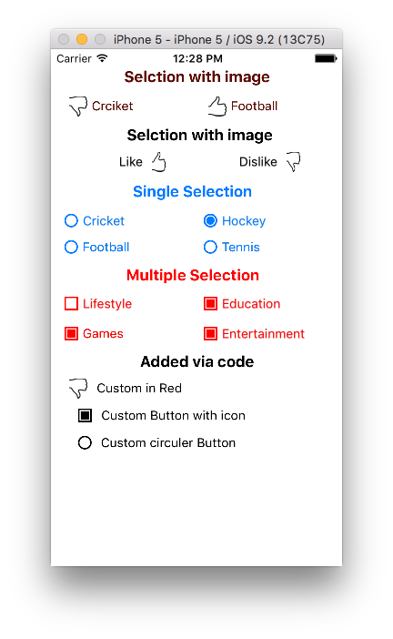
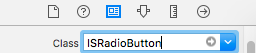
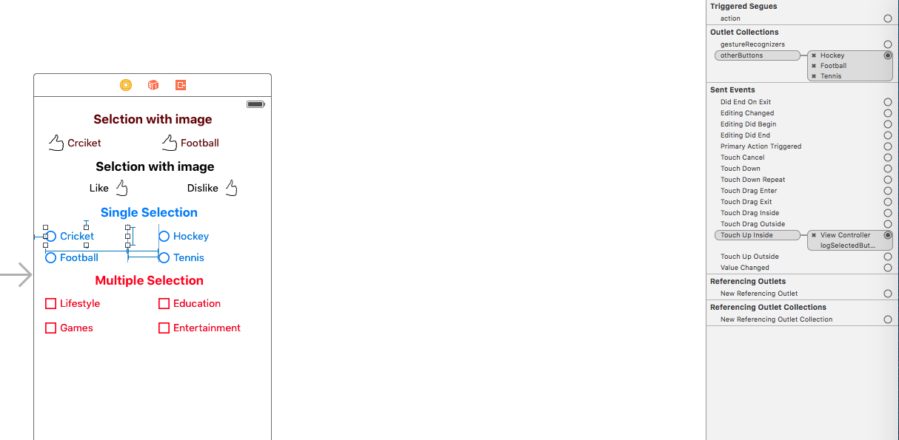
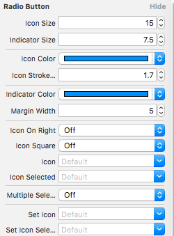

# ISRadioButton 
A highly customisable Radio Button for iOS using swift. 

Inspired by [DLRadioButton] (https://github.com/DavydLiu/DLRadioButton).  (Swift copy of DLRadioButton with a little extra functionality)

1. It have single selection ability for both radio and square button

2. It have multiple selection ability for both radio and square button

## Preview

## A dding ISRadioButton to your project

### Source files:
*    Add ISRadioButton.swift in your project. (Demo is added for functionality test and help)

## Usage

### Add radio buttons in interface builder:

1.  Put some UIButtons onto a View and change the UIButtons' type to "custom".

	

2.  Set the UIButtons' class to "ISRadioButton".

	

3.	Set "otherButtons" outlet.

	

### To customize ISRadioButton:

*	Simply set properties directly in Interface Builder.

	

*	Property reference:
	
	
	
### To add raido buttons programmatically, please refer to example project.

## Requirements

ARC, iOS 8.0

## Author

Ishaq Shafiq. For help or any qeustions, feel free to [open an issue](https://github.com/thegoal/ISRadioButton/issues/new).

## License

ISRadioButton is available under the MIT license.
